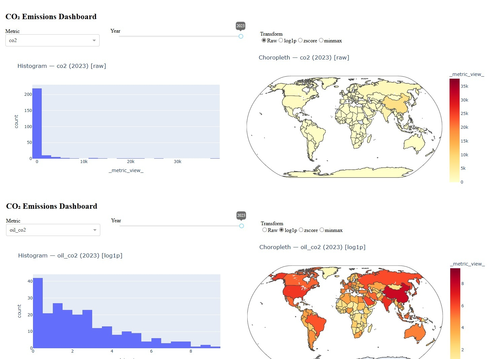

# CO₂ Emissions Visualization — Data Analyst 

####
A complete, reproducible mini-project for Course 8: Data Visualization with Python.
We analyze global CO₂ emissions by country and year, build multiple visualizations (histograms, maps), and ship an interactive dashboard.
A complete, reproducible mini-project for Global CO₂ emissions by country and year, build multiple visualizations (histograms, maps), and ship an interactive dashboard.
####

##🌍 Dataset
####
Source: Kaggle (Our World in Data–style CO₂ time series)

Content: Country/year CO₂ totals with optional per-capita & sector fields

Unit: co2 is measured in million tonnes of CO₂ (MtCO₂)

Column names may vary across CSVs (e.g., Name vs Entity, co2 vs co2_including_luc). We make the notebook robust to these differences.
####

##📁 Repository Structure

####
.
├─ data/
│  ├─ co2_emissions.csv
│  └─ world-countries.json        # auto-downloaded if missing
├─ notebooks/
│  └─ Global_CO2_Analysis         # main notebook
│── src/
│ └── app.py                      # Main Dash application
│── img/
│ └── dashboard_example.jpg        
└─ README.md
└─ requirement.txt

####

# CO₂ Emissions Dashboard 🌍

An interactive dashboard built with [Plotly Dash](https://dash.plotly.com/) to visualize global CO₂ emissions data.  
The app allows you to explore emissions by country, year, and metric, with transformations such as log scale, z-score, and min-max normalization.  

---

## Features ✨
- **Interactive controls**:
  - Dropdown to select emission metrics (e.g., total CO₂, coal, oil, gas).
  - Slider to choose a year.
  - Radio buttons to apply data transformations (`raw`, `log1p`, `zscore`, `minmax`).
- **Visualizations**:
  - Histogram of the selected metric.
  - Choropleth world map showing emissions distribution.
- **Automatic column detection**: works with datasets where column names may differ (`country`, `year`, `co2`, etc.).

---

## Project Structure 📂

##🧰 Environment
####
*Option A: conda
conda create -n co2viz python=3.10 -y
conda activate co2viz
pip install -r requirements.txt

*Option B: pip only
python -m venv .venv
. .venv/Scripts/activate  # Windows
pip install -r requirements.txt
####

##requirements.txt
pandas
numpy
matplotlib
seaborn
plotly
jupyter-dash
dash
folium
requests

#### Usage 🚀

Place your dataset in the data/ folder:

Default filename: co2_emissions.csv

You can rename your file, but ensure the path in app.py matches.

Run the app:

python src/app.py

Open your browser at:

http://127.0.0.1:8050/

or, if running on a server:

http://<your-ip>:8050/

Example Screenshots 🖼️

## Example Screenshot

Histogram of CO₂ emissions for a selected year.

World map showing emissions distribution.